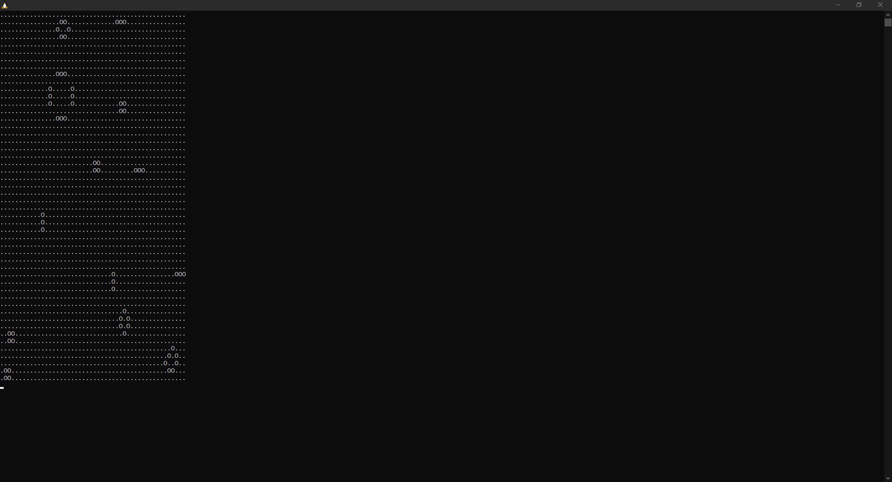
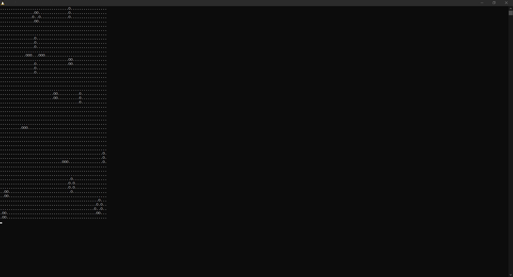

# GameOfLIfe

This is a simple implementation of Conway's Game of Life In C  
  
It does not have any graphical cababilities right now outside of refreshing the array and printing it to the console. Example outputs can be seen below.  
  
# Example Outpute 
Starting State:  

End States (has 2 final states)

